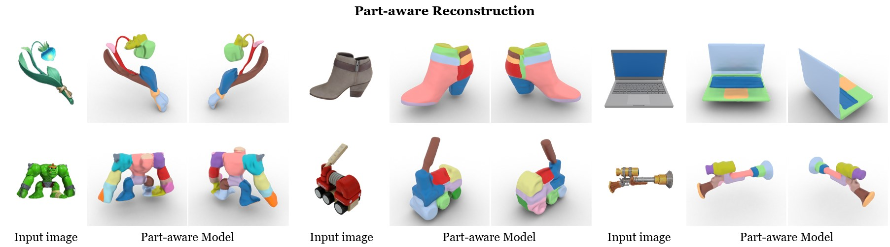

# Part123
This is the official repository for our paper "Part123: Part-aware 3D Reconstruction from a Single-view Image".




## [Project page](https://liuar0512.github.io/part123_official_page/) | [Paper](https://arxiv.org/abs/2405.16888)

Please use the above links to visit our webpage and refer to our paper for more details. Thank you for your interest!


### Installation & Preparation

1. set up the environment: We have tested the codes with python 3.8, pytorch 1.13.0 and torchvision 0.14.0. Other required packages can be found in `requirements.txt`

   ```
   conda create -n part123 python=3.8
   conda activate part123
   pip install -r requirements.txt
   cd raymarching
   python setup.py build_ext --inplace
   ```

2. download pre-trained models and put them in the directory "```ckpt```":

- [download link](https://connecthkuhk-my.sharepoint.com/:f:/g/personal/yuanly_connect_hku_hk/EjYHbCBnV-VPjBqNHdNulIABq9sYAEpSz4NPLDI72a85vw) for SyncDreamer. See its [original repository](https://github.com/liuyuan-pal/SyncDreamer) for more details.

- [download link](https://dl.fbaipublicfiles.com/segment_anything/sam_vit_h_4b8939.pth) (the default version) for SAM. See its [original repository](https://github.com/facebookresearch/segment-anything) for more details.

Double-check that you have the following models:
```bash
part123
|-- ckpt
    |-- ViT-L-14.pt
    |-- syncdreamer-pretrain.ckpt
    |-- sam_vit_h_4b8939.pth
```


### Inference

Our method includes three main steps: multiview diffusion, part-aware reconstruction, and automatic part segmentation. We provide two choices to run the code, using testing cases provided in "```testdata```":

- **Choice One**: use the ".sh" to run all the steps with a single command:

```
bash test_pipeline.sh
```

- **Choice Two**: run step-by-step according to the instructions below:

  *Note*: here we use "```bear.png```" for example. You can simply change "```bear```" to the name of an arbitrary image stored in "```testdata```".

1. *Multiview diffusion* generates multiview images using SyncDreamer for an input image.

```
CUDA_VISIBLE_DEVICES=0 python generate.py --ckpt ckpt/syncdreamer-pretrain.ckpt --input testdata/bear.png --output output/mvimgs/bear --elevation 30  --crop_size 200
```

- `--input`: path to the input image in RGBA format with an alpha-channel foreground mask.
- `--output`: output directory.

For other parameters, we adopt the suggested ones by SyncDreamer. Please refer [here](https://github.com/liuyuan-pal/SyncDreamer?tab=readme-ov-file#inference) for more details on the choice of each parameter.

Since SyncDreamer will generate four different samples, we choose the 1st sample `0.png` for subsequent steps as a default setting. You may manually select other samples for testing.

2. *Part-aware reconstruction* first predicts 2D segmentation masks using SAM: 

```
CUDA_VISIBLE_DEVICES=0 python sam_amg.py --checkpoint ckpt/sam_vit_h_4b8939.pth --model-type default
```

and then optimizes a part-aware NeuS network:

```
CUDA_VISIBLE_DEVICES=0 python train_part123.py -i output/mvimgs/bear/mvout.png -n bear -b configs/neus_cw.yaml -l output/renderer
```

- `-l`: root directory for log files
- `-i`: path to the multiview images
- `-n`: output directory under `-l`

3. *Automatic part segmentation* extracts the reconstructed model with part segments.

```
CUDA_VISIBLE_DEVICES=0 python test_part123.py -i output/mvimgs/bear/mvout.png -n bear -b configs/neus_cw.yaml -l output/renderer -r
```

The definition of arguments is the same as those for *Part-aware reconstruction*. Result of part-aware reconstruction can be found in `output/renderer/bear/samauto_vis.ply`.


### Acknowledgement

Our codes have been intensively borrowed from these repositories. We sincerely appreciate the authors for sharing their codes.

- [SyncDreamer](https://github.com/liuyuan-pal/SyncDreamer)
- [SAM3D](https://github.com/Pointcept/SegmentAnything3D)
- [SAM](https://github.com/facebookresearch/segment-anything)


### Citation

If you find this work useful for your project, please kindly cite it as follows:

```
@inproceedings{liu2024part123,
  title={Part123: Part-aware 3D Reconstruction from a Single-view Image},
  author={Liu, Anran and Lin, Cheng and Liu, Yuan and Long, Xiaoxiao and Dou, Zhiyang and Guo, Hao-Xiang and Luo, Ping and Wang, Wenping},
  booktitle={ACM SIGGRAPH 2024 Conference Papers},
  pages={1--12},
  year={2024}
}
```
